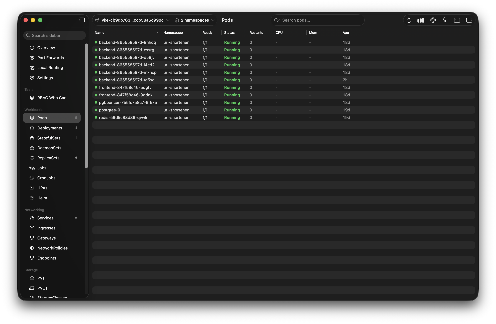
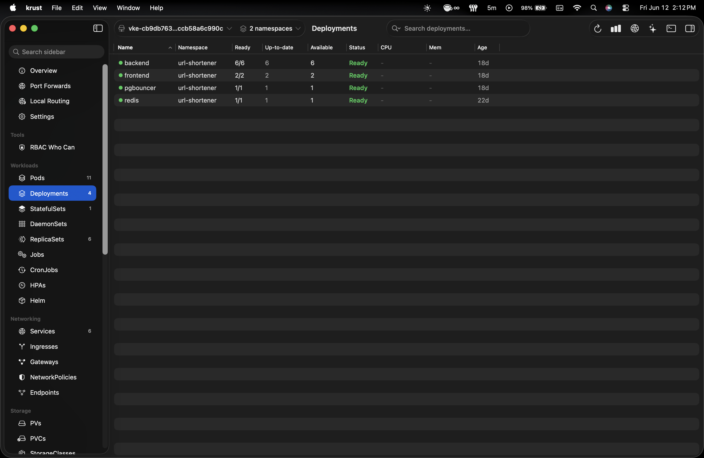

# Helmsman

A native macOS Kubernetes manager. Browse every resource type, stream live logs, edit YAML, scale workloads, manage rollouts — all against your existing kubeconfig. No cloud account. No cluster agent. No Electron.

**Landing page:** [helmsman-landing.vercel.app](https://helmsman-landing.vercel.app)  
**Download:** *(DMG coming soon)*

---

## Screenshots

| Pods view | Deployments view |
|-----------|-----------------|
|  |  |

---

## What it does

Helmsman gives you a fast native workspace for your Kubernetes clusters:

- **Browse any resource** — Pods, Deployments, StatefulSets, DaemonSets, Jobs, CronJobs, Services, Ingresses, ConfigMaps, Secrets, Nodes, and everything else including CRDs. The backend is fully dynamic: no per-resource code, just the Kubernetes API.
- **Live auto-refresh** — Every resource list opens a real Kubernetes Watch stream. Changes appear automatically (no manual refresh needed). A green indicator in the toolbar shows when the watch is active.
- **Stream live logs** — Open a dedicated log window for any pod. Filter by text, switch containers, toggle follow mode.
- **Edit YAML** — Fetch any resource as YAML, edit it in the built-in editor, apply with ⌘S using server-side apply.
- **Scale workloads** — Scale Deployments, StatefulSets, and ReplicaSets. The context menu shows the current replica count and updates the list immediately on success.
- **Rollout management** — Deployments, StatefulSets, and DaemonSets expose rollout actions: restart, view revision history, roll back to any previous revision, pause, and resume.
- **Suspend & resume** — Suspend or resume CronJobs and Jobs directly from the context menu (patches `spec.suspend`).
- **Cancel jobs** — Cancel a running Job: suspends it and deletes all its active pods in one action.
- **Drain nodes** — Cordon a node and evict all non-DaemonSet pods with a confirmation dialog.
- **Inspect resources** — Overview panel, collapsible JSON tree, and raw YAML tab for any selected object.
- **Multi-context** — Switch between kubeconfig contexts from the sidebar. Works with any cluster kubectl can reach.

---

## Architecture

Helmsman is two pieces:

```
helmsman-api/        Go backend — talks to Kubernetes
helmsman-frontend/   SwiftUI macOS app — talks to the Go backend
helmsman-landing/    Next.js marketing site
```

### Backend (`helmsman-api`)

A small Go HTTP server that acts as a local proxy between the SwiftUI app and the Kubernetes API. It uses `client-go`'s dynamic client and RESTMapper so it works with any resource type — built-in or CRD — without any per-resource code.

**Key decisions:**
- **Server-side Table format** — list endpoints request `Accept: application/json;as=Table`, which returns kubectl-identical columns for any resource including CRDs.
- **Dynamic GVR resolution** — the URL carries a resource slug (`pods`, `deployments.apps`, `virtualservices.networking.istio.io`). The backend resolves it to a concrete GVR via the cluster's RESTMapper.
- **Context in URL path** — `{ctx}` as a path segment keeps the server stateless. Client bundles are lazily built and cached per context.
- **SSE for logs and watch** — pod logs and Kubernetes Watch events both stream line-by-line over `text/event-stream`. The watch stream reconnects automatically when the API server closes it (typically every 5–10 min), tracking `resourceVersion` for continuity.
- **Generic workload actions** — scale, restart, rollout pause/resume/undo, and suspend/resume all use `{workload}` as a path segment resolved dynamically, so no per-resource handler code is needed.

**Stack:** Go 1.26 · stdlib `net/http` (1.22 routing) · `k8s.io/client-go` v0.32 · `sigs.k8s.io/yaml` · Swagger via `swaggo/swag`

### Frontend (`helmsman-frontend`)

A native macOS app written in Swift 6 and SwiftUI. All resource types share the same generic list view and detail panel — there is no per-resource UI code. The app gets its data entirely from the Go backend; it never talks to Kubernetes directly.

**Key decisions:**
- **`@Observable` ViewModels** — no `ObservableObject` or `@Published`. Just mutate properties.
- **Actor-based API client** — `KubeAPIClient` is a Swift `actor` singleton. Log and watch streaming use `AsyncThrowingStream` over `URLSession.bytes`.
- **Live watch in every list** — `ResourceListModel` opens a watch SSE stream after the initial load. On any event it debounces a reload (300 ms), so rapid changes coalesce into a single API call. All 20+ resource types get live updates automatically.
- **Generic table + detail** — one `ResourceListView` and one `ResourceDetailView` render every resource type. Adding a new resource to the sidebar is one line in `ResourceCatalog.swift`.
- **Capability-driven context menu** — `ResourceType` carries flags (`scaleWorkload`, `restartWorkload`, `suspendWorkload`, `supportsPause`, `supportsCancel`, `supportsDrain`). `ResourceListView.rowMenu` uses these to show only the actions that are valid for the selected resource type.
- **Separate windows for logs and YAML** — opened via SwiftUI's `WindowGroup(id:for:)` with `Codable` target values.

**Stack:** Swift 6 · SwiftUI · macOS 14+

---

## Getting started

### Prerequisites

- macOS 14 (Sonoma) or later
- Xcode 16+
- Go 1.22+
- A working `~/.kube/config` pointing at a cluster

### 1. Clone

```bash
git clone https://github.com/hashir-ayaz/helmsman.git
cd helmsman
```

### 2. Start the backend

```bash
cd helmsman-api
make run          # starts on :8080
```

The backend reads `KUBECONFIG` from the environment, falling back to `~/.kube/config`. You can override the port with `PORT=9090 make run`.

Other make targets:

```bash
make build        # compile to bin/helmsman-api
make tidy         # go mod tidy
make docs         # regenerate swagger docs
```

Swagger UI is available at `http://localhost:8080/swagger/` once the server is running.

### 3. Open the frontend

Open `helmsman-frontend/k67s.xcodeproj` in Xcode and press **Run** (⌘R). The app expects the backend on `http://localhost:8080`.

> **Note:** The app uses the macOS `com.apple.security.network.client` entitlement to reach localhost. No other special permissions are needed.

---

## Project structure

```
helmsman-api/
  cmd/server/main.go              entry point
  internal/
    config/config.go              PORT and KUBECONFIG env vars
    cluster/provider.go           multi-context client bundles (lazy, cached)
    k8s/
      resolver.go                 URL slug → GVR via RESTMapper
      resources.go                list (Table), get, YAML, delete, patch, apply
      actions.go                  scale, restart, suspend, cancel job
      rollout.go                  rollout history, undo, pause, resume
      drain.go                    node cordon + pod eviction
      logs.go                     pod log streaming
      watch.go                    Kubernetes Watch → SSE event channel
    handler/
      handlers.go                 handler aggregate + shared helpers
      resources.go                ResourceHandler (CRUD + YAML)
      actions.go                  ActionHandler (scale, restart, suspend, cancel, drain)
      rollout.go                  RolloutHandler (history, undo, pause, resume)
      logs.go                     LogHandler (SSE)
      watch.go                    WatchHandler (SSE watch stream)
      contexts.go                 ContextHandler (list kubeconfig contexts)
      response.go                 JSON envelope helpers
      table.go                    metav1.Table → TablePayload
      errors.go                   k8s API errors → HTTP status codes
    server/server.go              route registration, graceful shutdown
  docs/                           generated swagger (do not edit)

helmsman-frontend/k67s/
  k67sApp.swift                   app entry point, window declarations
  ContentView.swift               root NavigationSplitView
  Models/
    ResourceCatalog.swift         sidebar resource catalog + capability flags
    RevisionEntry.swift           rollout history entry (decoded from API)
    TablePayload.swift            decoded server-side Table response
    JSONValue.swift               flexible JSON type for heterogeneous K8s objects
    APIResponse.swift             envelope decoder + APIError enum
    WatchEvent.swift              SSE watch event (type, name, namespace)
  Services/
    KubeAPIClient.swift           actor API client (baseURL: localhost:8080)
    BackendProcess.swift          embedded sidecar lifecycle manager
  ViewModels/
    AppModel.swift                contexts, namespace, selected resource
    ResourceListModel.swift       table data, search, live watch, debounce reload
    ResourceDetailModel.swift     JSON object + YAML (lazy)
    ResourceActionsModel.swift    all workload actions (scale/restart/rollout/suspend/cancel/drain)
    RolloutHistorySheetModel.swift  load history + perform undo
    LogStreamModel.swift          SSE log streaming, 5 000-line buffer
    YAMLEditorModel.swift         YAML load + server-side apply
  Views/
    SidebarView.swift             context/namespace pickers + resource list
    ResourceListView.swift        generic table view + live-watch indicator
    ResourceDetailView.swift      Overview / Object / YAML panel
    RolloutHistorySheet.swift     revision list + "Undo to this" sheet
    LogWindowView.swift           log streaming window
    YAMLEditorWindow.swift        YAML editor
    Components/                   StatusDot, JSONTreeView, PortChipsView, RowActionAlerts, …

helmsman-landing/                 Next.js marketing site (solar-dusk theme)
```

---

## API reference

The full OpenAPI spec is at [`helmsman-api/docs/swagger.yaml`](helmsman-api/docs/swagger.yaml). Interactive Swagger UI is served at `http://localhost:8080/swagger/` when the backend is running.

Quick reference:

| Method | Path | Description |
|--------|------|-------------|
| `GET` | `/api/v1/contexts` | List kubeconfig contexts |
| `GET` | `/api/v1/contexts/{ctx}/resources/{resource}` | List cluster-scoped resources (Table) |
| `GET` | `/api/v1/contexts/{ctx}/namespaces/{ns}/resources/{resource}` | List namespaced resources (Table) |
| `GET` | `/api/v1/contexts/{ctx}/namespaces/{ns}/resources/{resource}/{name}` | Get one object |
| `GET` | `/api/v1/contexts/{ctx}/namespaces/{ns}/resources/{resource}/{name}/yaml` | Get raw YAML |
| `POST` | `/api/v1/contexts/{ctx}/resources` | Apply a YAML manifest (server-side apply) |
| `PATCH` | `/api/v1/contexts/{ctx}/namespaces/{ns}/resources/{resource}/{name}` | Merge patch |
| `DELETE` | `/api/v1/contexts/{ctx}/namespaces/{ns}/resources/{resource}/{name}` | Delete |
| `GET` | `/api/v1/contexts/{ctx}/namespaces/{ns}/resources/{resource}/watch` | Watch stream (SSE) |
| `GET` | `/api/v1/contexts/{ctx}/resources/{resource}/watch` | Watch stream — cluster-scoped (SSE) |
| `POST` | `/api/v1/contexts/{ctx}/namespaces/{ns}/deployments/{name}/scale` | Scale (Deployments — legacy path) |
| `POST` | `/api/v1/contexts/{ctx}/namespaces/{ns}/{workload}/{name}/scale` | Scale any workload (StatefulSets, ReplicaSets, …) |
| `POST` | `/api/v1/contexts/{ctx}/namespaces/{ns}/{workload}/{name}/restart` | Rollout restart |
| `GET` | `/api/v1/contexts/{ctx}/namespaces/{ns}/{workload}/{name}/rollout/history` | Rollout revision history |
| `POST` | `/api/v1/contexts/{ctx}/namespaces/{ns}/{workload}/{name}/rollout/undo` | Roll back `{"toRevision": N}` (0 = previous) |
| `POST` | `/api/v1/contexts/{ctx}/namespaces/{ns}/{workload}/{name}/rollout/pause` | Pause rollout |
| `POST` | `/api/v1/contexts/{ctx}/namespaces/{ns}/{workload}/{name}/rollout/resume` | Resume rollout |
| `POST` | `/api/v1/contexts/{ctx}/namespaces/{ns}/{workload}/{name}/suspend` | Suspend CronJob / Job |
| `POST` | `/api/v1/contexts/{ctx}/namespaces/{ns}/{workload}/{name}/resume` | Resume CronJob / Job |
| `POST` | `/api/v1/contexts/{ctx}/namespaces/{ns}/jobs/{name}/cancel` | Cancel job (suspend + delete pods) |
| `POST` | `/api/v1/contexts/{ctx}/nodes/{name}/drain` | Drain node `{"gracePeriodSeconds": N}` |
| `GET` | `/api/v1/contexts/{ctx}/namespaces/{ns}/pods/{name}/log` | Stream pod logs (SSE) |

`{ctx}` accepts `_current` to mean the active kubeconfig context.  
`{resource}` accepts bare kind (`pods`) or `kind.group` (`deployments.apps`, `virtualservices.networking.istio.io`).  
`{workload}` accepts bare kind (`deployments`, `statefulsets`, `cronjobs`, …).

---

## Contributing

Contributions are welcome. Here's how the codebase is organised so you can find your way around quickly.

### Adding a new resource type to the sidebar

Edit `helmsman-frontend/k67s/Models/ResourceCatalog.swift` and add an entry to `ResourceType.all`. The backend requires no changes — it is fully dynamic.

```swift
.init(title: "HorizontalPodAutoscalers", resource: "horizontalpodautoscalers.autoscaling",
      symbol: "arrow.up.and.down", scope: .namespaced, section: .workloads),
```

To expose new capabilities for the type (scale, suspend, etc.), add the corresponding computed property to `ResourceType` in the same file.

### Adding a new backend action

Actions that don't fit the generic CRUD pattern live in their own files:

1. Add the business logic to `helmsman-api/internal/k8s/actions.go` (simple patches) or a new `k8s/<feature>.go` file for more complex operations
2. Add the HTTP handler method to `helmsman-api/internal/handler/actions.go` or a new `handler/<feature>.go`
3. Register the route in `helmsman-api/internal/server/server.go`
4. Add a Swagger annotation and run `make docs`
5. Add the corresponding method to `KubeAPIClient.swift` and wire up the UI in `ResourceActionsModel.swift` and `ResourceListView.rowMenu`

### Running backend tests

```bash
cd helmsman-api
go test -race ./...
go test -cover ./...
```

Tests use `k8s.io/client-go/dynamic/fake` and `k8s.io/client-go/kubernetes/fake` — no live cluster needed.

### Code style

- **Go:** `gofmt` and `goimports`. Errors wrapped with `fmt.Errorf("context: %w", err)`.
- **Swift:** SwiftFormat. `@Observable` for all ViewModels. `@MainActor` on models that mutate SwiftUI state. No mutation of existing objects — return new values.

### What's not yet implemented

These are good areas to contribute:

- [ ] `exec` / shell into a pod (requires WebSocket/SPDY)
- [ ] Port-forward
- [ ] Resource event stream in the detail panel
- [ ] Rollout history for StatefulSets and DaemonSets (currently uses ReplicaSets; StatefulSets/DaemonSets need ControllerRevisions)
- [ ] Dark/light mode toggle in the landing page

### Opening a PR

1. Fork the repo and create a branch from `main`.
2. Make your changes. Keep diffs focused — one concern per PR.
3. For backend changes, ensure `go test -race ./...` passes.
4. Open a PR with a short description of what and why.

---

## License

MIT — see [LICENSE](LICENSE).
